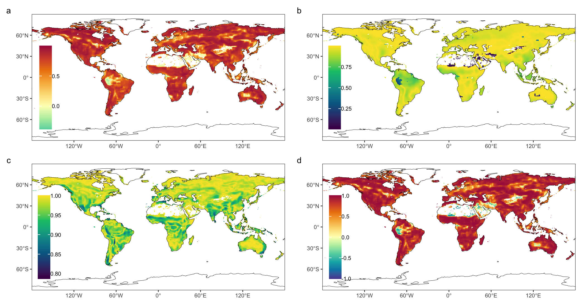
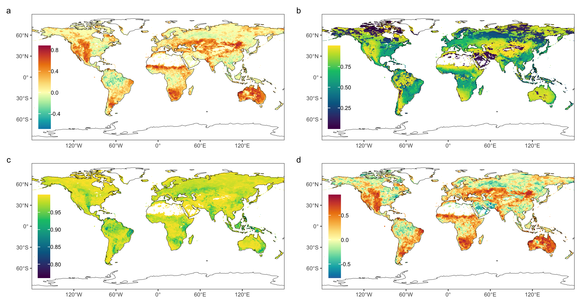

```{r setup, include=FALSE}
options(htmltools.dir.version = FALSE)
knitr::opts_chunk$set(echo = FALSE, message=FALSE, warnings=FALSE)
library(tidyverse)
library(latex2exp)
```

# Objectives {.block}

Develop a generic composite measure of association between geospatial variables which:

- can compare the central tendencies, variabilities, and capture the correlation coefficient
- is available for variable both positively and negative correlated
- can detect the relative association between variabels with different content
- can be applied to both spatial and temporal domain

# Introduction

A single metric can not fully characterize the fit between the predicted and observed data. Some composite measures have been developed and applied, such as the Structural SIMilarity (SSIM) [@wang2004] and Composite similarity measure based on Means, Standard deviations and Correlation coefficient (CMSC) [@palubinskas2017]. But those measures have limitations in wild applications:

1. SSIM requires both variabels have the same sign, which is resolved by its variant CMSC.
2. CMSC uses the squared Euclidean distance which leads to a nonlinear responce curve.
3. They have poor performances for variables that negatively correlated.
4. Can not compare variables with different scales.

# Generic composite similarity measure (GCSM)

The GCSM was proposed based on CMSC.

- The Euclidean distance was used to make $s_1$ and $s_2$ linear functions.
- The distance for $s_1$ was differently defined for positive and negative correlation.
- Apply fuzzy sets to transform variables to the same scale 0-1.

$$GCSM(x, y)=s_{1}(x, y) \cdot s_{2}(x, y) \cdot s_{3}(x, y)$$

# Mathematical Section

$$s_{1}=\left\{\begin{array}{ll}{1-\frac{\left|\mu_{x}-\mu_{y}\right|}{max-min}} & \text{ if }{s_{3}>0}; \\ {1-\frac{\left|min+max-\mu_{x}-\mu_{y}\right|}{max-min}} & \text{ if }{s_{3}<0}.\end{array}\right.$$

$$s_{2}=1-\frac{\left|\sigma_{x}-\sigma_{y}\right|}{(max-min)/2}$$

$$s_{3}=\left\{\begin{array}{ll}{1} & \text{ if } {\sigma_{x}=\sigma_{y}=0}; \\ 
{0} & \text{ if } {\sigma_{x}=0 \text { or } \sigma_{y}=0}; \\ 
{\frac{\sigma_{x y}}{\sigma_{x} \sigma_{y}}} & {\text { otherwise. }}\end{array}\right.$$

# Examples

```{r,fig.show='hold',out.width='25%', fig.cap='Some examples showing the calculation of GCSM'}
library(fssim)
plotfig <- function(df,shape,slope,intercept,xloc,yloc){
  labels <- df %>% 
    summarise(s1=str_c('s[1]==',round(gcsm(x,y,fuzzy=F,comp='s1',xmin=0,xmax=1,ymin=0,ymax=1),3)),
              s2=str_c('s[2]==',round(gcsm(x,y,fuzzy=F,comp='s2',xmin=0,xmax=1,ymin=0,ymax=1),3)),
              s3=str_c('s[3]==',round(gcsm(x,y,fuzzy=F,comp='s3',xmin=0,xmax=1,ymin=0,ymax=1),3)),
              si=str_c('GCSM==',round(gcsm(x,y,fuzzy=F,comp='si',xmin=0,xmax=1,ymin=0,ymax=1),3))) %>% 
    gather(comp,label) %>% 
    mutate(x=xloc,y=seq(yloc,yloc-0.12,length.out=4))
  df %>% 
    ggplot()+aes(x,y)+
    geom_point(shape=shape)+
    geom_abline(linetype='dashed',slope=slope,intercept=intercept)+
    geom_text(aes(x,y,label=label),data=labels,parse=T,size=5)+
    # coord_cartesian(expand=F)+
    scale_x_continuous(limits=c(0,1),breaks=c(0,1),labels=c('min','max'))+
    scale_y_continuous(limits=c(0,1),breaks=c(0,1),labels=c('min','max'))
}
set.seed(2019)
noise <- rnorm(81,0,0.02)
set.seed(2019)
noise2 <- rnorm(81,0,0.03)
tb1 <- tibble(x=seq(0.4,0.8,length.out=81),y=x-0.2+noise)
tb2 <- tibble(x=seq(0.6,0.2,length.out=81),y=-x+1-0.2+noise)
tb3 <- tibble(x=seq(0.4,0.8,length.out=81),y=x*1.5-0.3+noise2)
tb4 <- tibble(x=seq(0.6,0.2,length.out=81),y=-1.5*x+1.2+noise2)

plotfig(tb1,'circle', 1,0,0.8,0.44)+
  theme_bw(18)+theme(panel.grid=element_blank())
plotfig(tb2,'circle open',-1,1,0.2,0.44)+
  theme_bw(18)+theme(panel.grid=element_blank())
plotfig(tb3,'triangle',1,0,0.55,0.94)+
  theme_bw(18)+theme(panel.grid=element_blank())
plotfig(tb4,'triangle open',-1,1,0.45,0.94)+
  theme_bw(18)+theme(panel.grid=element_blank())
```


# Usage example 1: Spatial cnsistency between two estimates of GPP

```{r, fig.cap='Spatial similarity between average annual MPI and MOD, (a) GCSM which is the multiplication of (b) s~1~, (c) s~2~, and (d) s~3~'}

```

# Usage example 2: Association between GPP and rainfall

```{r, fig.cap='Temporal association between annual GPP and precipitation, (a) GCSM which is the multiplication of (b) s~1~, (c) s~2~, and (d) s~3~.'}

```

# Sensitivity test

```{r, fig.align='center',out.width='100%',fig.cap='Similarity measures of SSIM, CMSC, and GCSM between MPI and MPI distorted by Gaussian noise'}
sens_std <- read_csv('sens_std.csv')
sens_std %>% 
  rename(gcsm=gcmsc) %>% 
  rename_at(vars(-(1:3)),toupper) %>% 
  gather(measure,similarity,-c(1:3)) %>% 
  mutate(measure=factor(measure,levels=c('SSIM','CMSC','GCSM'))) %>% 
  ggplot()+aes(x=std,y=similarity,color=measure)+
  geom_point(size=0.8)+
  # scale_color_grey(start=0.8,end=0.2)+
  labs(x='Standard deviation of noise',y='Similarity measure')+
  scale_x_continuous(expand=expand_scale(mult=c(0.002,0.05)))+
  scale_y_continuous(expand=expand_scale(mult=c(0.05,0.002)))+
  theme_bw(14)+
  theme(legend.title=element_blank())+
  theme(legend.position=c(0.15,0.24))
```


# Conclusion

GCSM showed improved characteristics compared with SSIM and CMSC. It had a higher sensitivity and could measure the negative dependence between variables. With the framework of fuzzy sets, the relative association could also be obtained between variables with different scales. Case studies showed the GCSM can be applied to both spatial and temporal domains of spatiotemporal ecological variables.


# References

